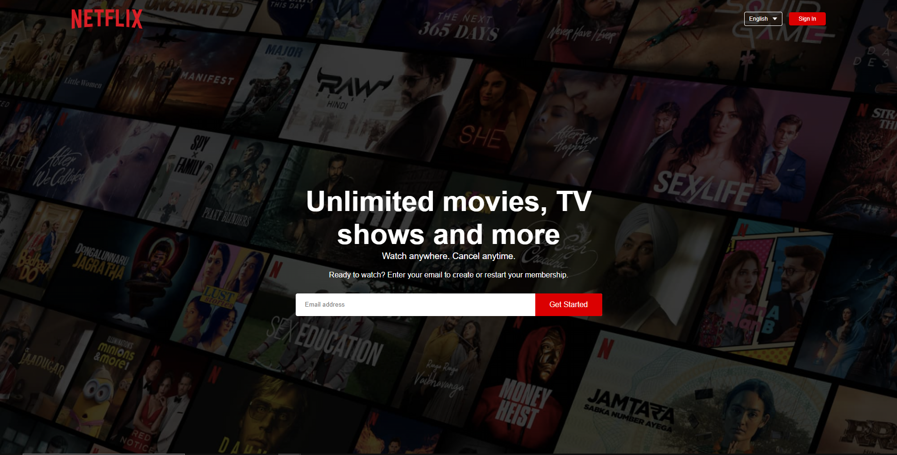

# Netflix Landing Page Clone

This repository contains a clone of the Netflix landing page, created as a project to practice web development skills. The goal of this project is to faithfully recreate the visual design and user experience of the official Netflix landing page.

## Demo

You can see a live demo of the Netflix Landing Page Clone at [Demo Link](https://your-demo-link.com).

## Features

- Faithful clone of the Netflix landing page.
- Responsive design to ensure a seamless experience on various screen sizes.
- Carousel section showcasing popular shows and movies.
- User-friendly navigation and interface.

## Technologies Used

- HTML5
- CSS3

## Installation

1. Clone the repository: `git clone https://github.com/luapNaya/netflix-clone`
2. Navigate to the project directory: `cd netflix-landing-page-clone`

## Usage

1. Open the `index.html` file in a web browser to view the Netflix Landing Page Clone.
2. Navigate through the page to explore the different sections and elements.
3. Customize and modify the clone according to your preferences or use it as a learning resource.

## Contributing

Contributions are welcome! If you find any issues or want to enhance the clone, feel free to submit a pull request. Please make sure to follow the [Contributing Guidelines](CONTRIBUTING.md).

## License

This project is licensed under the [MIT License](LICENSE).

---

**Disclaimer:** This project is intended for educational purposes only. It is not associated with Netflix or its official website in any way.
